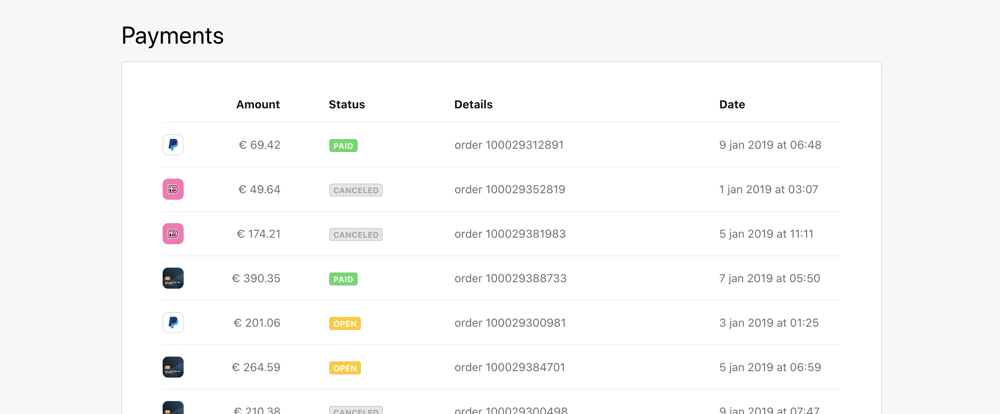

<p align="center">
  
</p>
<h3 align="center">Payments app</h3>

---

## 📝 Table of Contents

- [About](#about)
- [Demo](#demo)
- [Getting Started](#getting_started)
- [Tests](#tests)
- [Tools](#tools)

## 🧐 About <a name = "about"></a>

This repo is made to showcase one of the test assignments that I have done. The requirements for the assignment are quoted below.

> - This assignment was built on top of [Create React App](https://create-react-app.dev/), see [their documentation](https://create-react-app.dev/docs/getting-started) should you run into any technical issues.
> - Routing is handled by [React Router](https://reacttraining.com/react-router/web/guides/quick-start).
> - Both [CSS Modules](https://github.com/css-modules/css-modules) and [Sass](https://sass-lang.com/) are supported in the project, but feel free to use vanilla CSS if you prefer.
> - You can ignore older browsers.
>
> ## Exercise #1
>
> Make sure payments are fetched from the API (`http://localhost:4000/api/payments`) on the [payments page](http://localhost:3000/payments). You will find the code in `src/pages/Payments/Overview/index.js`. This exercise does not prescribe a way of storing data, you can store the payments on the client however you feel is best.
>
> ## Exercise #2
>
> In the root of this project you will find `PaymentsTableDesktop.png` and `PaymentsTableMobile.png`. Your task is to implement these designs and render the payments you fetched in the previous exercise to the screen.
>
> ## Exercise #3
>
> Implement the payment detail page on the route `/payments/:id`. The view already exists, but you will need to fetch some additional data, namely the refunds a payment might have. You can do this by querying the `http://localhost/api/payments/:id/refunds`. The refunds table should have the same kind of structure as the payments table, but don’t spend too much time on it.
>
> ## Exercise #4
>
> If a resource—for example a payment or customer—is fetched on one page, you should be able to re-use it on other pages without re-fetching it. If the data is older than 2 minutes, fetch a new copy instead.
>
> ## Requirements
>
> - The design should be responsive.
> - The design needs to resemble the PNG, but pixel perfection is not expected.
> - Each row should link to a detail page, the route for which is `/payments/:id`.
> - Handle state changes and exceptions.
> - We like tests.
> - We like documentation and clarification.

## 🎮 Demo <a name = "demo"></a>

Live demo available here: https://payments-app.barchewbacca.now.sh

## 🏁 Getting Started <a name = "getting_started"></a>

These instructions will get you a copy of the project up and running on your local machine for
development and testing purposes.

### Install client dependencies

```sh
# yarn
yarn

# npm
npm install
```

### Start client and server

```sh
# yarn
yarn start

# npm
npm run start
```

Now you can open the app at `http://localhost:3000/`.

## 🔧 Running tests <a name = "tests"></a>

Even though I love tests and TDD, the coverage is pretty poor because of the shortage of time. There are both unit and e2e tests implemented.

### Unit tests

In order to check unit tests coverage rates run from the `root` folder:

```sh
# yarn
yarn test:coverage

# npm
npm run test:coverage
```

You may also open the coverage report locally from here:
`client/coverage/lcov-report/index.html`

### e2e tests

> ⚠️ Keep in mind that the server should be running.
> Use `yarn start` to do this.

In order to check e2e tests coverage headlessly(without displaying the browser) run from the `client` folder:

```sh
# yarn
yarn e2e

# npm
npm run e2e
```

In order to check e2e tests coverage headed(with displaying the browser) run from the `client` folder:

```sh
# yarn
yarn e2e:headed

# npm
npm run e2e:headed
```

You may find the e2e tests captured video here: `client/cypress/videos/`

## ⛏️ Tools <a name = "tools"></a>

- [React](https://reactjs.org/)
- [Create React App](https://create-react-app.dev/)\*\*\*\*
- [TypeScript](https://www.typescriptlang.org/)
- [Jest](https://jestjs.io/)
- [Cypress](https://www.cypress.io/)
